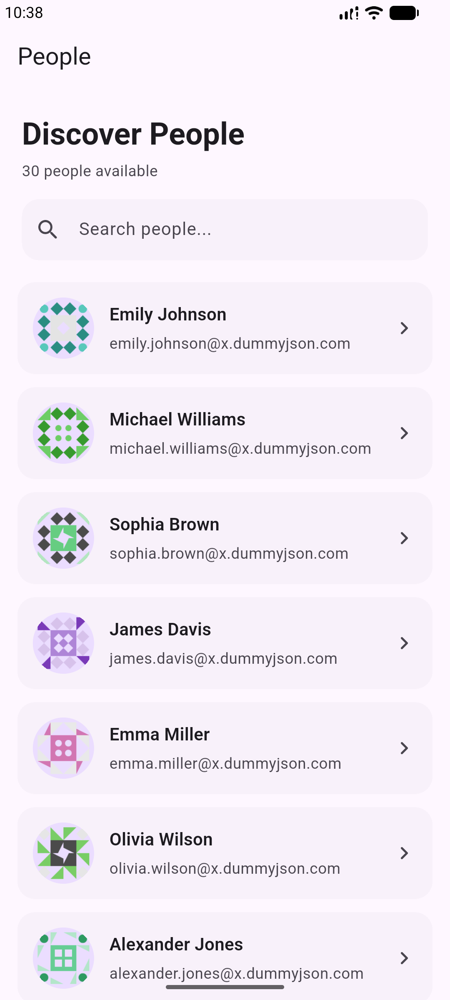
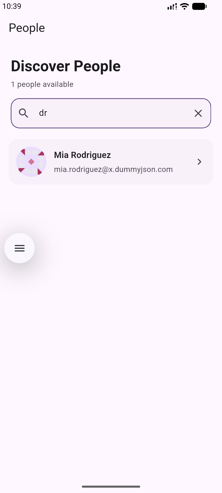
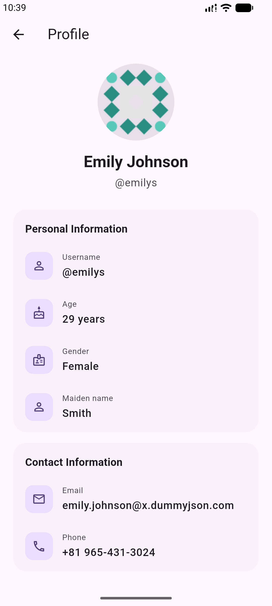

# User Directory

A polished Flutter application that demonstrates REST API integration, JSON parsing, state management, search, error handling, loading states, and user-focused UI design.

The application fetches user data from the DummyJSON Users API and presents it through a responsive user directory interface with profile details, local search, pull-to-refresh, skeleton loading states, and graceful error handling.

---

## Overview

User Directory was developed as part of a Flutter internship task focused on API integration and networking.

The primary objective of the project is to demonstrate how a Flutter application can:

* Fetch data from a REST API
* Parse JSON responses into Dart models
* Manage asynchronous state using Riverpod
* Display API data efficiently
* Handle loading, success, empty, and error states
* Implement local search
* Refresh remote data
* Navigate between list and detail screens
* Provide a polished and responsive user experience

Rather than focusing only on successfully fetching API data, the application also handles the different states that occur during real-world network communication.

---
Download App [https://drive.google.com/file/d/1XI3-qLZT_EUjDrSajg1-R19c4v0CyCWs/view?usp=sharing]

---
## App Preview

<table>
  <tr>
    <th>Home</th>
    <th>Search</th>
    <th>Profile</th>
  </tr>
  <tr>
    <td>
      
    </td>
    <td>
      
    </td>
    <td>
      
    </td>
  </tr>
</table>

---

## Demo Video

<p align="center">
  <video src="SS/demo.mp4" width="320" controls>
    Your browser does not support the video tag.
  </video>
</p>

---

## Features

### User Directory

The main screen fetches and displays users from the API in a scrollable directory.

Each user card displays:

* Profile picture
* Full name
* Email address
* Navigation to the detailed profile screen

### User Search

Users can be searched locally using:

* First name
* Last name
* Full name
* Username
* Email address

Search state is managed independently from API state using Riverpod.

Filtering is performed locally because the user dataset is already available in memory. This avoids unnecessary network requests and provides immediate search results.

### User Profile

Selecting a user opens a detailed profile screen.

The profile screen displays:

* Profile picture
* Full name
* Username
* Age
* Gender
* Maiden name, when available
* Email address
* Phone number

The profile data is fetched separately using the selected user's ID. This allows the profile screen to independently demonstrate loading, success, and error states.

### Fullscreen Profile Image

The profile image can be opened in a fullscreen image viewer.

The image viewer supports:

* Hero animation transition
* Pinch-to-zoom
* Image panning
* Close and back navigation
* Image loading failure handling

### Pull-to-Refresh

The user directory supports pull-to-refresh.

During refresh:

* Existing content remains visible
* Updated data is requested from the API
* Successful responses update the list
* Failed refresh requests preserve the existing data
* A non-blocking message informs the user about the failure

This prevents temporary network failures from unnecessarily removing already available content.

### Loading States

The application uses skeleton loading interfaces instead of relying only on centered progress indicators.

The user list skeleton matches the approximate structure of the actual user cards, reducing layout shift when data becomes available.

The profile screen also provides a dedicated skeleton layout that represents the final profile screen structure.

### Error Handling

The application handles common API and networking failures, including:

* No internet connection
* Request timeout
* Invalid request
* Resource not found
* Server errors
* Invalid response data
* Unexpected errors

Error states provide clear feedback and allow the user to retry the failed request.

### Empty States

Dedicated empty states are provided for:

* Empty API responses
* Search queries with no matching users

This prevents blank screens and gives the user clear feedback about the current application state.

---

## Application States

The application explicitly handles multiple UI states.

### User Directory States

| State             | UI Behavior                                            |
| ----------------- | ------------------------------------------------------ |
| Loading           | Displays user card skeletons                           |
| Success           | Displays the user directory                            |
| Empty             | Displays an empty state                                |
| Error             | Displays an error message with retry action            |
| Refreshing        | Keeps current users visible while refreshing           |
| Refresh Error     | Keeps current data and displays a non-blocking message |
| Search Results    | Displays filtered users                                |
| No Search Results | Displays a search-specific empty state                 |

### Profile States

| State   | UI Behavior                              |
| ------- | ---------------------------------------- |
| Loading | Displays profile skeleton                |
| Success | Displays user details                    |
| Error   | Displays an error view with retry action |

---

## Tech Stack

* Flutter
* Dart
* Riverpod
* HTTP package
* REST API
* Material 3
* Shimmer loading effects

---

## API

The application uses the DummyJSON Users API.

The following API operations are used:

```text
GET /users
```

Fetches the list of users.

```text
GET /users/{id}
```

Fetches a specific user using their ID.

---

## Architecture

The project follows a lightweight layered architecture suitable for the scope of the application.

```text
UI
 │
 ▼
Riverpod Controller
 │
 ▼
Repository
 │
 ▼
API Client
 │
 ▼
REST API
```

Each layer has a focused responsibility.

### API Client

Responsible for:

* Sending HTTP requests
* Applying request timeouts
* Checking HTTP status codes
* Decoding JSON responses
* Converting low-level networking errors into application exceptions

### Repository

Responsible for:

* Calling the API client
* Accessing user endpoints
* Converting JSON data into User models
* Returning application-ready data to controllers

### Riverpod Controllers

Responsible for:

* Loading users
* Loading individual profiles
* Managing asynchronous state
* Refreshing data
* Retrying failed requests
* Exposing application state to the UI

### Presentation Layer

Responsible for:

* Watching Riverpod providers
* Rendering loading states
* Rendering successful data
* Rendering empty states
* Rendering error states
* Handling user interaction
* Navigation between screens

---

## State Management

The project uses Riverpod without code generation.

No `build_runner` or Riverpod annotations are required.

The application uses manually declared providers such as:

```dart
final userControllerProvider =
    AsyncNotifierProvider<UserController, List<User>>(
  UserController.new,
);
```

Search state is managed independently:

```dart
final userSearchControllerProvider =
    NotifierProvider<UserSearchController, String>(
  UserSearchController.new,
);
```

This separation keeps networking state and UI search state independent.

The overall state flow is:

```text
UserController
    │
    ├── Loading
    ├── Data
    └── Error
          │
          ▼
      UsersScreen
          │
          ▼
UserSearchController
          │
          ▼
    Local Filtering
          │
     ┌────┴────┐
     │         │
 Results    No Results
```

---

## Project Structure

```text
lib/
│
├── main.dart
│
├── data/
│   │
│   ├── api/
│   │   └── api_client.dart
│   │
│   ├── models/
│   │   └── user.dart
│   │
│   └── repository/
│       └── user_repository.dart
│
├── presentation/
│   │
│   ├── users/
│   │   └── user_screen.dart
│   │
│   └── profile/
│       ├── profile_screen.dart
│       └── fullscreen_image_screen.dart
│
├── provider/
│   ├── api_provider.dart
│   └── search_provider.dart
│
└── shared/
    ├── empty_view.dart
    ├── error_view.dart
    └── skeleton_user_card.dart
```

---

## Data Flow

### Fetching Users

```text
UsersScreen
     │
     ▼
userControllerProvider
     │
     ▼
UserController
     │
     ▼
UserRepository
     │
     ▼
ApiClient
     │
     ▼
GET /users
     │
     ▼
JSON Response
     │
     ▼
List<User>
     │
     ▼
AsyncValue<List<User>>
     │
     ▼
UsersScreen
```

### Opening a User Profile

```text
User Card
    │
    ▼
ProfileScreen(userId)
    │
    ▼
profileControllerProvider(userId)
    │
    ▼
UserRepository
    │
    ▼
GET /users/{id}
    │
    ▼
User
    │
    ▼
Profile UI
```

---

## User Model

The application currently reads the following fields from the API:

```dart
class User {
  final int id;
  final String firstName;
  final String lastName;
  final String maidenName;
  final int age;
  final String gender;
  final String email;
  final String phone;
  final String username;
  final String image;
}
```

The model provides a `fromJson` factory constructor to convert API responses into strongly typed Dart objects.

---

## UI and UX Decisions

### Skeleton Loading

Skeleton screens are used for initial loading because they communicate the expected content structure before the data becomes available.

The skeleton layout approximately matches the final content layout to reduce perceived loading time and visual layout shifts.

### Existing Data Preservation

When pull-to-refresh fails, the application keeps the previously loaded users visible instead of replacing the screen with a full-page error.

A full error screen is used only when no usable data is available.

### Separate Search State

Search is kept separate from API state.

This allows the application to:

* Preserve fetched users
* Update search results immediately
* Clear search without refetching data
* Avoid unnecessary API requests

### Independent Profile Loading

The profile screen requests user data using the selected user ID instead of relying only on the object passed from the list.

This allows the profile feature to independently demonstrate:

* API integration
* Loading state
* Error handling
* Retry behavior

### Hero Transitions

Hero animations provide visual continuity when navigating between user avatars and profile images.

The fullscreen image viewer extends this experience by allowing users to inspect the profile image using zoom and pan gestures.

---

## Getting Started

### Prerequisites

Make sure Flutter is installed and correctly configured.

Verify the installation:

```bash
flutter doctor
```

### Clone the Repository

```bash
git clone <repository-url>
```

Navigate into the project directory:

```bash
cd user_directory
```

Install dependencies:

```bash
flutter pub get
```

Run the application:

```bash
flutter run
```

---

## Dependencies

The main packages used in the project are:

```yaml
dependencies:
  flutter:
    sdk: flutter

  flutter_riverpod:
  http:
  shimmer:
```

Package versions are available in `pubspec.yaml`.

---

## Key Learning Outcomes

This project demonstrates practical understanding of:

* REST API integration in Flutter
* HTTP GET requests
* JSON parsing
* Dart model creation
* Repository pattern
* Riverpod state management
* AsyncNotifier
* Notifier
* Provider dependency flow
* Loading state design
* Skeleton loading interfaces
* Network error handling
* Retry mechanisms
* Pull-to-refresh behavior
* Local search filtering
* Empty state design
* Navigation
* Hero animations
* Interactive image viewing
* Material 3 UI development

---

## Possible Future Improvements

The project can be extended with:

* Pagination or infinite scrolling
* Debounced server-side search
* Offline caching
* Connectivity-aware UI
* Favorite users
* User sorting and filtering
* Unit tests
* Repository tests
* Controller tests
* Widget tests
* Custom application theme
* Dark mode
* Shared reusable avatar widget with initials fallback
* More detailed profile information

---

## Conclusion

User Directory demonstrates more than a basic API request and ListView implementation.

The project focuses on the complete lifecycle of API-driven mobile interfaces:

```text
Request
   ↓
Loading
   ↓
Success / Empty / Error
   ↓
User Interaction
   ↓
Search / Refresh / Navigation
   ↓
Detailed Data
```

The goal of the application is to combine clear architecture, reliable networking behavior, explicit state management, and polished UI feedback while remaining within the scope of a focused Flutter API integration project.
